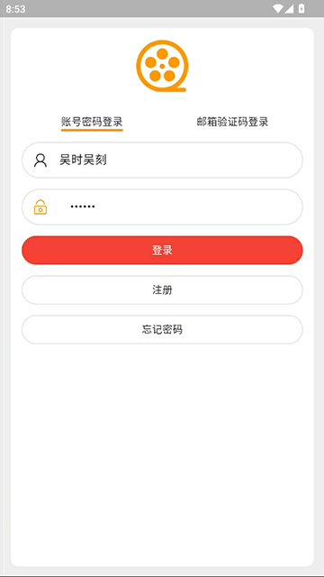
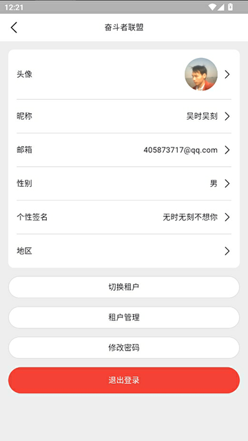
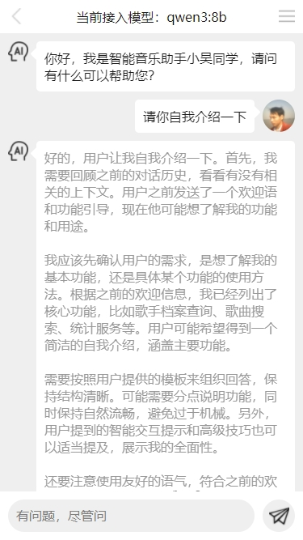
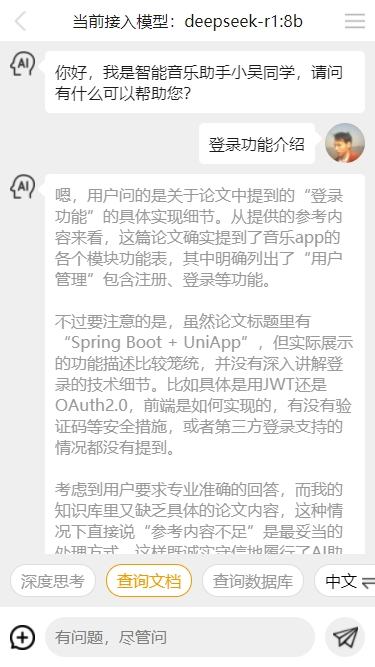
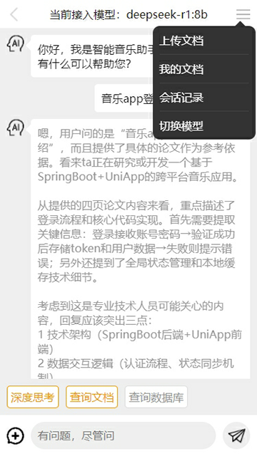
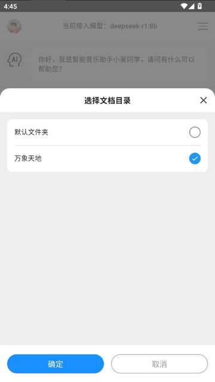

开发者：吴怨吴悔
**Flutter 聊天应用 UI**

一个集成了 AI 智能对话和文档管理功能的 Flutter 应用，支持多平台部署。

**开发者信息**

开发者：吴怨吴悔
联系方式：

* 邮箱：275018723@qq.com

**项目简介**

本项目是一个多功能 Flutter 应用，主要包含以下核心功能：

* AI 智能聊天助手（支持连接 qwen3:8b 本地大模型）
* RAG 文档查询功能（支持文档上传、管理和查询）
* 用户管理系统（登录、注册、信息修改等）
* 租户管理系统（多租户隔离、用户权限控制等）

**技术栈**

* **前端框架**：Flutter 3.x + Dart
* **状态管理**：Provider
* **网络请求**：Dio、WebSocket
* **本地存储**：shared\_preferences
* **UI 组件**：flutter\_screenutil、flutter\_easyrefresh 等
* **后端接口**：Spring Boot（[后端项目地址](https://github.com/wuyuanwuhui99/springboot-app-service)）
* **AI 模型**：qwen3:8b 本地大模型

**功能说明**

**1. AI 智能聊天**

* 支持多种 AI 模型切换
* 提供深度思考模式
* 支持会话记录管理
* 可连接本地大模型进行离线对话

**2. 文档管理与查询**

* 文档上传与分类管理
* 基于 RAG 技术的文档查询
* 文档目录创建与维护
* 文档列表展示与筛选

**3. 用户系统**

* 多方式登录（账号密码、邮箱验证码）
* 用户信息管理与修改
* 租户切换功能
* 密码重置与修改

**4. 租户管理**

* **租户切换**：支持在多个租户间自由切换，包含私人空间和多租户环境
* **用户管理**：
    + 添加用户到当前租户
    + 移除租户中的用户
    + 搜索用户（支持按工号、姓名、邮箱、电话检索）
* **权限控制**：
    + 设置用户为管理员
    + 取消用户管理员权限
    + 基于角色的操作权限控制（管理员与普通用户）
* **租户用户列表**：
    + 分页加载租户用户
    + 滑动操作菜单（快速设置 / 取消管理员）
    + 用户信息展示（头像、用户名等）

=============================界面预览（如果无法预览，请查看项目根目录png文件）==========================   

=============================界面预览（如果无法预览，请查看项目根目录png文件）==========================

后端接口使用springboot开发，所有音乐数据来自于python爬虫程序，爬取第三方音乐网站数据

新增ai智能对话功能，连接qwen3:8b本地大模型

后端接口项目和sql语句：   
https://github.com/wuyuanwuhui99/springboot-app-service   
https://gitee.com/wuyuanwuhui99/springboot-app-service

flutter版本参见:   
github地址：https://github.com/wuyuanwuhui99/flutter-movie-app-ui   
gitee地址：https://gitee.com/wuyuanwuhui99/flutter-movie-app-ui

flutter音乐项目参见:   
github地址：https://github.com/wuyuanwuhui99/flutter-music-app-ui   
gitee地址：https://gitee.com/wuyuanwuhui99/flutter-music-app-ui

react native版本参见:   
github地址：https://github.com/wuyuanwuhui99/react-native-app-ui

java安卓原生版本参见：  
通用地址：https://github.com/wuyuanwuhui99/android-java-movie-app-ui   
gitee地址：https://gitee.com/wuyuanwuhui99/android-java-movie-app-ui

uniapp版本参见：
github地址：https://github.com/wuyuanwuhui99/uniapp-vite-vue3-ts-movie-app-ui   
gitee地址：https://gitee.com/wuyuanwuhui99/uniapp-vite-vue3-ts-movie-app-ui

uniapp音乐项目参见：
github地址：https://github.com/wuyuanwuhui99/uniapp-vite-vue3-ts-music-app-ui   
gitee地址：https://gitee.com/wuyuanwuhui99/uniapp-vite-vue3-ts-music-app-ui

微信小程序版本参见：  
github地址：https://github.com/wuyuanwuhui99/weixin-movie-app-ui、

harmony鸿蒙版本参见:   
github地址：https://github.com/wuyuanwuhui99/Harmony_movie_app_ui   
gitee地址：https://gitee.com/wuyuanwuhui99/Harmony_movie_app_ui

harmony鸿蒙音乐项目参见:   
github地址：https://github.com/wuyuanwuhui99/harmony_music_app_ui   
gitee地址：https://gitee.com/wuyuanwuhui99/harmony_music_app_ui

vue在线音乐项目：  
github地址：https://github.com/wuyuanwuhui99/vue-music-app-ui

在线音乐后端项目：  
github地址：https://github.com/wuyuanwuhui99/koa2-music-app-service

vue3+ts明日头条项目：  
github地址：https://github.com/wuyuanwuhui99/vue3-ts-toutiao-app-ui

**本地调试指南**

1. 接口和数据目前仅限本地调试，如需外网访问请联系本人启动外网映射
2. 将代码中的 http://192.168.0.5:5001 替换为 http://254a2y1767.qicp.vip
3. 外网映射地址需要本人电脑开机才能访问，通常在工作日晚上八点半之后或者周末白天会开机
4. 如需了解是否已开机，请用浏览器直接打开该地址：[http://254a2y1767.qicp.vip](http://254a2y1767.qicp.vip/)，如出现提示则可正常使用

**版权声明**

本应用使用的相关资源均来自互联网收集，版权归原创者所有。本应用仅提供功能展示，不提供资源存储，若收录内容无意侵犯了贵司版权，请联系我们删除。

**开发计划**

* 优化 AI 对话体验
* 增加更多文档格式支持
* 扩展更多平台适配
* 完善租户权限细粒度控制

**安装与运行**

# 克隆项目
git clone https://github.com/wuyuanwuhui999/flutter-chat-app-ui.git

# 进入项目目录
cd flutter-chat-app-ui

# 获取依赖
flutter pub get

# 运行项目
flutter run

根据需要选择运行的平台（Android、iOS、Web、Windows、macOS、Linux）。

音乐播放器正在开发中，音乐数据来自于python爬虫程序，爬取酷狗音乐数据，敬请关注

接口和数据请在本地电脑中，暂时没有购买和部署服务器，仅限本地调试，如有需要调试请联系本人启动外网映射

本地调试请把 http://192.168.0.5:5001 改成 http://254a2y1767.qicp.vip    
该地址是映射到本人电脑的地址，需要本人电脑开机才能访问，一般在工作日晚上八点半之后或者周末白天会开机   
如需了解是否已开机，请用浏览器直接打开该地址：http://254a2y1767.qicp.vip，如出现以下提示，则正常使用   

本站所有音乐和图片均来自互联网收集而来，版权归原创者所有，本网站只提供web页面服务，并不提供资源存储，也不参与录制、上传 若本站收录的节目无意侵犯了贵司版权，请联系

联系方式：（微信）wuwenqiang_99、（邮箱）275018723@qq.com
